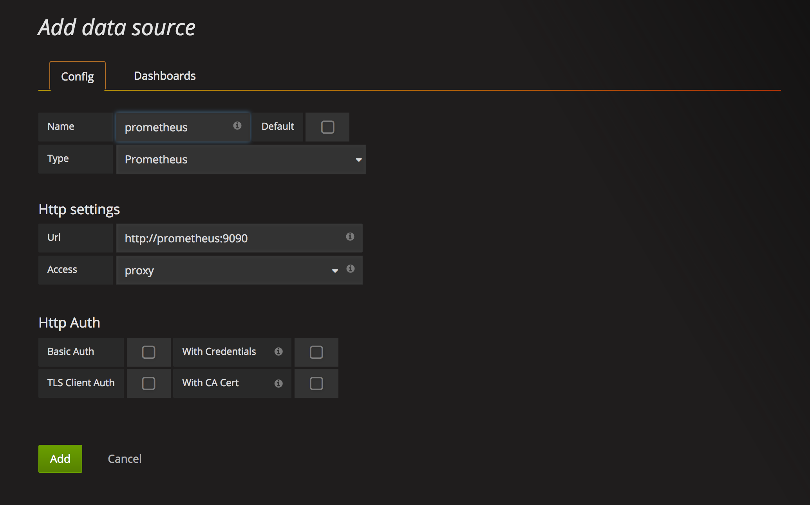
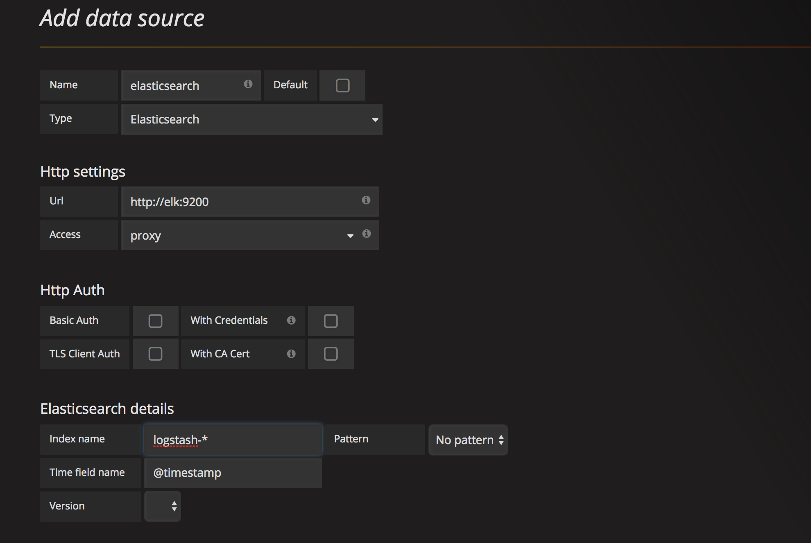
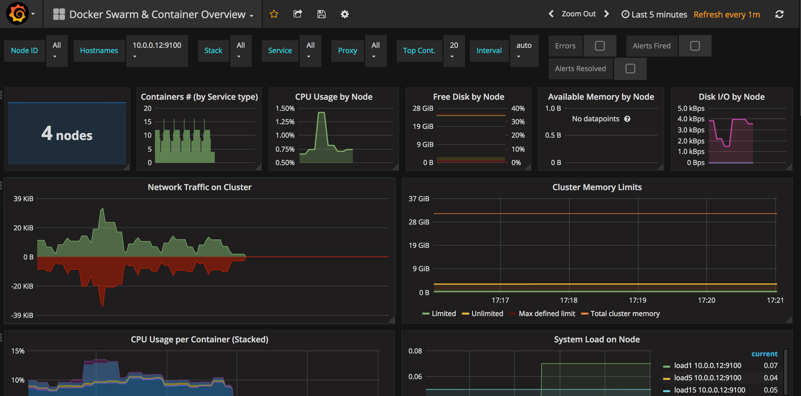

# Prometheus Swarm

A sample image that can be used as a base for collecting Swarm mode metrics in Prometheus

## How to use it

You can configure the full system with the next commands, that create the Prometheus, Grafana and exporters services needed.

```bash
docker \
  network create --driver overlay monitoring

docker \
  service create --name cadvisor \
  --mode global \
  --network monitoring \
  --label com.docker.stack.namespace=monitoring \
  --container-label com.docker.stack.namespace=monitoring \
  --mount type=bind,src=/,dst=/rootfs:ro \
  --mount type=bind,src=/var/run,dst=/var/run:rw \
  --mount type=bind,src=/sys,dst=/sys:ro \
  --mount type=bind,src=/var/lib/docker/,dst=/var/lib/docker:ro \
  google/cadvisor:v0.24.1

docker \
  service create --name node-exporter \
  --mode global \
  --network monitoring \
  --label com.docker.stack.namespace=monitoring \
  --container-label com.docker.stack.namespace=monitoring \
  --mount type=bind,source=/proc,target=/host/proc \
  --mount type=bind,source=/sys,target=/host/sys \
  --mount type=bind,source=/,target=/rootfs \
  --mount type=bind,source=/etc/hostname,target=/etc/host_hostname \
  -e HOST_HOSTNAME=/etc/host_hostname \
  basi/node-exporter \
  -collector.procfs /host/proc \
  -collector.sysfs /host/sys \
  -collector.filesystem.ignored-mount-points "^/(sys|proc|dev|host|etc)($|/)" \
  --collector.textfile.directory /etc/node-exporter/ \
  --collectors.enabled="conntrack,diskstats,entropy,filefd,filesystem,loadavg,mdadm,meminfo,netdev,netstat,stat,textfile,time,vmstat,ipvs"

docker \
  service create --name alertmanager \
  --network monitoring \
  --label com.docker.stack.namespace=monitoring \
  --container-label com.docker.stack.namespace=monitoring \
  --publish 9093:9093 \
  -e "SLACK_API=https://hooks.slack.com/services/TOKEN-HERE" \
  -e "LOGSTASH_URL=http://logstash:8080/" \
  basi/alertmanager \
    -config.file=/etc/alertmanager/config.yml

docker \
  service create \
  --name prometheus \
  --network monitoring \
  --label com.docker.stack.namespace=monitoring \
  --container-label com.docker.stack.namespace=monitoring \
  --publish 9090:9090 \
  basi/prometheus-swarm \
    -config.file=/etc/prometheus/prometheus.yml \
    -storage.local.path=/prometheus \
    -web.console.libraries=/etc/prometheus/console_libraries \
    -web.console.templates=/etc/prometheus/consoles \
    -alertmanager.url=http://alertmanager:9093

docker \
  service create \
  --name grafana \
  --network monitoring \
  --label com.docker.stack.namespace=monitoring \
  --container-label com.docker.stack.namespace=monitoring \
  --publish 3000:3000 \
  -e "GF_SERVER_ROOT_URL=http://grafana.${CLUSTER_DOMAIN}" \
  -e "GF_SECURITY_ADMIN_PASSWORD=$GF_PASSWORD" \
  -e "PROMETHEUS_ENDPOINT=http://prometheus:9090" \
  -e "ELASTICSEARCH_ENDPOINT=$ES_ADDRESS" \
  -e "ELASTICSEARCH_USER=$ES_USERNAME" \
  -e "ELASTICSEARCH_PASSWORD=$ES_PASSWORD" \
  basi/grafana


docker \
  service create \
  --name elk \
  --network monitoring \
  --label com.docker.stack.namespace=monitoring \
  --container-label com.docker.stack.namespace=monitoring \
  --publish 5601:5601 \
  --publish 9200:9200 \
  --publish 5044:5044 \
  sebp/elk
```

Once everyting is running you just need to connect to grafana and import the [Docker Swarm & Container Overview](https://grafana.net/dashboards/609)

In case you don't have an Elasticsearch instance with logs and errors you could provide an invalid configuration. But I suggest you to have it correctly configured to get all the dashboard offers.

You can use the provided `docker-compose.yml` file as an example. You can deploy the full stack with the command:

```bash
docker stack deploy --compose-file docker-compose.yml monitoring
```  

### Add Data Sources

Navigate to graphana UI using http://<docker-host/docker-swarm-host>:3000 (Default creds: admin/admin)  

- Add prometheus as data source



- Add elasticsearch as data source



- Import [Docker Swarm & Container Overview](https://grafana.net/dashboards/609)


- Dashboard looks like this




### Docker Engine Metrics
In case you have activated the metrics endpoint in your docker swarm cluster you could import the [Docker Engine Metrics](https://grafana.net/dashboards/1229) dashboard as well, which offers complementary data about the docker daemon itself.

More info available about this dashboard and its configuration in this post [Docker Daemon Metrics in Prometheus](https://medium.com/@basilio.vera/docker-swarm-metrics-in-prometheus-e02a6a5745a#.ei8n7eykb)
